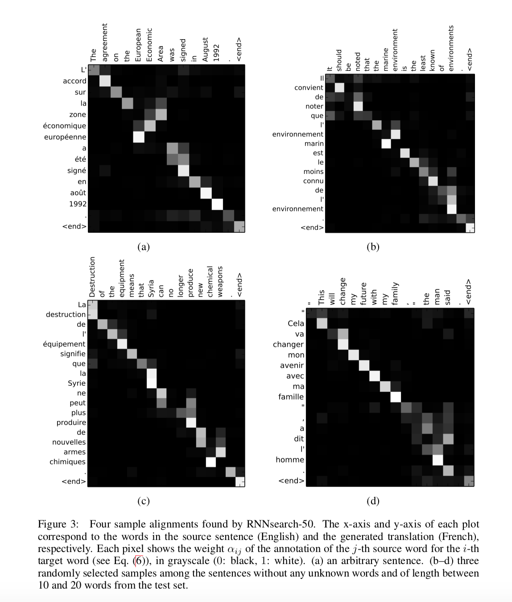

# NEURAL MACHINE TRANSLATION BY JOINTLY LEARNING TO ALIGN AND TRANSLATE (ICLR 2015)

Authors: Dzmitry Bahdanau, KyungHyun Cho, Yoshua Bengio

https://arxiv.org/pdf/1409.0473.pdf

### Abstract

- The problem with existing neural machine translation (NMT) techniques is that the encoders produce a fixed length vector (loss of information / not all information is equally useful at all parts).
- Instead, allow model to soft search for most relevant parts of a source sentence.

### Intro

- Most NMT models are encoder-decoder
  - requires compressing all info into a single vector
    - reduces performance on longer length sentences
- **Propose extension:** allow encoder-decoder to align and translate jointly
  - Everytime the model generates a word, it first looks at the most relevant parts of the source sentence
    - Model predicts word based on context vectors associated and prev generated words
  - Encode source sentence into a **sequence of vectors** not a single vector and allow model to choose subsets
- Performs much better and about on par with conventional phrase-based systems

### Background: NMT

- Goal: maximize probability of output sentence given source sentence

### Learning to Align and Translate

- Define the conditional probability of generating word $y_i$ as 

  $p(y_i | y_1, \dots, y_{i-1}, x) = g(y_{i-1}, s_i, c_i)$ 

  where $s_i = f(s_{i-1}, y_{i-1},  c_i)$  is the hidden state computed computed for time $i$ and $g$ is a non-linear function that combines the hidden state and context vector (like a GRU / LSTM unit).

  **Critically, note that the predictions for each word depend on a distinct context vector $c_i$ rather than just one as in traditional encoder-decoder models.**

  Each $c_i$ is computed as a weighted sum of a series of *annotations:* $(h_1, \dots, h_{T_x})$ where each annotation $h_i$ contains information about the whole input sequence but strongly focuses around the $ith$ input.

  Hence, we get that  

  ​									$c_i = \sum_{j=1}^{T_x} \alpha_{ij} h_j$	

  where the weight for each annotation $\alpha_{ij}$ is given by:

  ​									$\alpha_{ij} = \frac{exp(e_{ij})}{\sum_{k=1}^{T_x} exp(e_{ik})}$ 

  $e_{ij}$ can be thought of as how much the inputs around position $j$ are relevant to the output at position $i$. Thus $e_{ij}$ is our measure of alignment and is given by:

  ​									$e_{ij} = a(s_{i-1}, h_j)$

  where $a$ is some function. We see that the alignment is set up to depend on the previous hidden state and the current annotation under considration. The authors of this work use a feedforward NN to parameterize and jointly train $a$ along with the other components of the NMT model. This attention mechanisms allows the decoder to choose what parts of the source sentence to pay attention to and allieviates the need for a single encoding.

  Note if we consider $\alpha_{ij}$ as the probability that the target word $y_{i}$ is aligned with / translated from source word $x_j$ then since $c_i$ is computed as a weighted sum of the annotations, we can treat $c_i$ as the expected annotation / expected source word.

- Bidirectional RNN as an encoder:

  - We want annotation $h_i$ to encode information about words both before and after the $ith$ word which can be addressed by inputing the words in order and in reverse creating a **bidirectional RNN**.
  - We can get an annotation for each word then by concatentating the hidden states created from the forward pass with the hidden states created from the backward pass. 
  - RNNs have a tendency to represent recent inputs better which softly enforces that annotation $h_j$ will be centered around word $x_j$

### Experiment Settings

- English-French translation
  - 348M words
  - 3003 sentences for test from WMT'14
  - 30000 most frequent words in each language, others mapped to UNK
  - **no lowercasing or stemming**
- Models
  - Classic RNN-Encoder/Decoder
  - RNNsearch (this paper)
  - Train each model 2x
    - once with sentences <= 30 words
    - once with sentences <= 50 words
  - 1000 hidden units in encoder / decoder
  - Maxout hidden layer to compute probability of words
  - SGD with Adadelta, batch size of 80 sentences
    - Training time: 5 days
  - Use beam search to find translation that maximizes probability

### Results

- RNNsearch > RNN Enc/Dec
- RNNsearch == phrase-based translation on sentences with known tokens

- Noted that, as hypothesized, performance of traditional enc/dec models goes down as sentences get longer, but RNNsearch does not deterioriate indicating a single fixed vector did seem to be a bottleneck

- Alignments look reasonable

  

 

- Authors argue soft alignment allows model to look over many places at once rather than mapping directly word-to-word